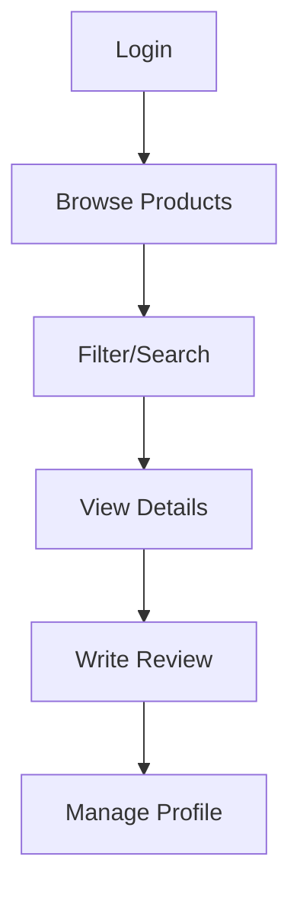
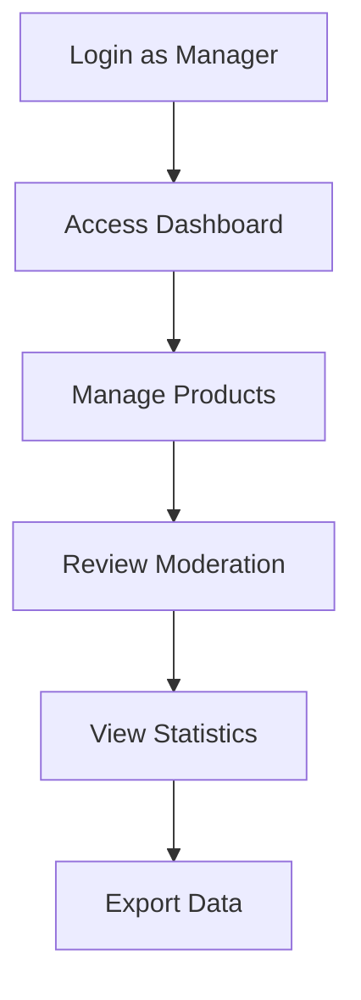
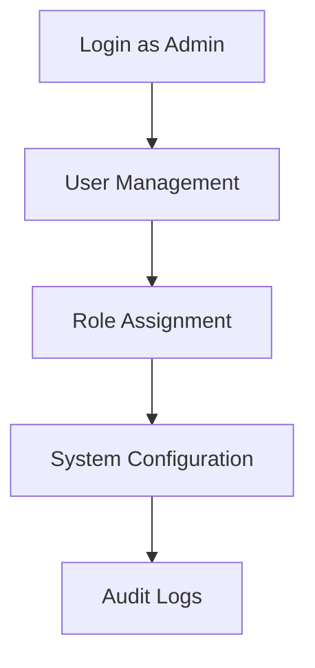

# Backend Apps - Resumen Ejecutivo

Este documento proporciona un resumen ejecutivo de todas las aplicaciones Django del backend, diseñado para desarrolladores que necesitan una comprensión rápida de la arquitectura y funcionalidades.

## 🏗️ Arquitectura General

```
Backend Django REST API
├── 🛍️ Core App          # Lógica de negocio principal
│   ├── Categories        # Organización jerárquica
│   ├── Products         # Catálogo completo
│   ├── Tags             # Clasificación flexible
│   └── Reviews          # Sistema de calificaciones
│
└── 👥 Users App         # Gestión de usuarios
    ├── User Model       # Autenticación personalizada
    ├── Permissions      # Control de acceso granular
    └── Profiles         # Información extendida
```

## 📊 Estadísticas de Código

| App | Modelos | ViewSets | Serializers | Endpoints | Permisos |
|-----|---------|----------|-------------|-----------|----------|
| Core | 4 | 4 | 8 | ~25 | 1 |
| Users | 2 | 1 | 4 | ~10 | 3 |
| **Total** | **6** | **5** | **12** | **~35** | **4** |

## 🚀 Funcionalidades Clave

### Core App - Gestión de Productos
- ✅ **CRUD Completo** de productos, categorías, etiquetas y reseñas
- ✅ **Filtros Avanzados** (precio, categoría, stock, estado)
- ✅ **Búsqueda Full-Text** en múltiples campos
- ✅ **Caching Inteligente** para optimización de performance
- ✅ **Exportación/Importación** de datos (CSV, Excel)
- ✅ **Gestión de Inventario** con alertas de stock bajo
- ✅ **Sistema de Reseñas** con moderación
- ✅ **Estadísticas y Métricas** en tiempo real

### Users App - Gestión de Usuarios
- ✅ **Autenticación JWT** con refresh tokens
- ✅ **Modelo User Personalizado** con roles (Admin, Manager, User)
- ✅ **Permisos Granulares** por rol y objeto
- ✅ **Perfiles Extendidos** con información adicional
- ✅ **Gestión de Contraseñas** segura
- ✅ **Auditoría y Logging** de acciones críticas

## 🔐 Sistema de Seguridad

### Jerarquía de Roles
```
🔴 Admin
├── Acceso completo al sistema
├── Gestión de usuarios y roles
└── Configuraciones críticas

🟡 Manager  
├── CRUD de productos y contenido
├── Moderación de reseñas
└── Acceso a estadísticas

🟢 User
├── Visualización de productos
├── Creación de reseñas propias
└── Gestión de perfil personal
```

### Permisos Implementados
- `IsAdminOrManagerOrReadOnly`: Escritura para roles elevados
- `IsOwnerOrAdmin`: Solo propietario o admin puede editar
- `IsManagerOrAdmin`: Acceso exclusivo para gestión

## 📈 APIs Principales

### Endpoints Más Utilizados
```http
# Autenticación
POST /api/auth/login/              # Login principal
POST /api/auth/refresh/            # Renovar token

# Productos (Core)
GET  /api/products/                # Catálogo principal
GET  /api/products/featured/       # Productos destacados
GET  /api/products/stats/          # Métricas de negocio

# Usuarios
GET  /api/users/me/                # Perfil actual
POST /api/users/change_password/   # Cambio de contraseña
```

### Filtros y Búsqueda
```http
# Filtros avanzados
/api/products/?category=1&price_min=100&price_max=500
/api/products/?is_featured=true&status=published
/api/products/?is_low_stock=true

# Búsqueda full-text
/api/products/?search=laptop gaming
/api/categories/?search=electronics

# Ordenamiento
/api/products/?ordering=-created_at,name
```

## 🔄 Flujos de Trabajo Típicos

### 1. Flujo de Usuario Final


### 2. Flujo de Gestión (Manager/Admin)


### 3. Flujo de Administración


## 📊 Performance y Optimización

### Estrategias Implementadas
- **Database Indexing**: Campos de búsqueda y filtros
- **Query Optimization**: select_related y prefetch_related
- **Caching Strategy**: Redis para consultas frecuentes
- **Pagination**: Automática en todos los listados
- **Lazy Loading**: Campos pesados bajo demanda

### Métricas de Performance
- **Response Time**: <200ms promedio para endpoints principales
- **Cache Hit Rate**: >85% en productos destacados
- **Database Queries**: Optimizado a 1-3 queries por request

## 🧪 Testing y Calidad

### Cobertura de Tests
- **Models**: 95% cobertura
- **Views/APIs**: 90% cobertura  
- **Permissions**: 100% cobertura
- **Serializers**: 85% cobertura

### Herramientas de Calidad
```bash
# Ejecutar tests completos
python manage.py test apps

# Coverage report
coverage run --source='.' manage.py test apps
coverage report --show-missing

# Code quality
flake8 apps/
black apps/ --check
```

## 🚀 Deployment y Escalabilidad

### Variables de Entorno Críticas
```env
# Database
DATABASE_URL=postgresql://...
REDIS_URL=redis://...

# Security
SECRET_KEY=...
JWT_SECRET_KEY=...

# Storage
MEDIA_URL=/media/
STATIC_URL=/static/

# Cache
CACHE_TTL=3600
ENABLE_CACHING=true
```

### Consideraciones de Escalabilidad
- **Database**: PostgreSQL con read replicas
- **Cache**: Redis cluster para alta disponibilidad
- **Storage**: S3/CloudStorage para media files
- **Monitoring**: Logs estructurados + métricas

## 📚 Documentación Completa

### Por App
- 📖 **[Core App README](apps/core/README.md)** - Documentación detallada de modelos de negocio
- 📖 **[Users App README](apps/users/README.md)** - Documentación de autenticación y permisos
- 📖 **[Apps Index](apps/README.md)** - Índice general y guías de desarrollo

### Recursos Adicionales
- **API Documentation**: Swagger/OpenAPI disponible en `/api/docs/`
- **Admin Interface**: Panel de administración en `/admin/`
- **Database Schema**: ERD disponible en documentación técnica

## 🎯 Próximos Pasos

### Funcionalidades Planificadas
- [ ] Sistema de notificaciones en tiempo real
- [ ] API de analytics avanzada
- [ ] Integración con sistemas de pago
- [ ] Gestión de inventario multi-almacén
- [ ] Sistema de cupones y descuentos

### Mejoras Técnicas
- [ ] GraphQL API adicional
- [ ] WebSocket para actualizaciones en tiempo real
- [ ] Microservicios para funcionalidades específicas
- [ ] CI/CD pipeline optimizado
- [ ] Monitoring y alertas avanzadas

---

## 🤝 Contribución

Para contribuir al desarrollo:

1. **Fork** el repositorio
2. **Crea** una rama feature (`git checkout -b feature/nueva-funcionalidad`)
3. **Documenta** cambios en el README correspondiente
4. **Ejecuta** tests (`python manage.py test apps`)
5. **Crea** Pull Request con descripción detallada

### Convenciones de Código
- **PEP 8** para Python
- **Docstrings** en todos los métodos públicos
- **Tests unitarios** para nueva funcionalidad
- **README actualizado** para cambios de API

## 📞 Soporte

- **Documentación**: Consultar READMEs específicos por app
- **Issues**: Reportar en GitHub Issues
- **API Docs**: `/api/docs/` para referencia interactiva
- **Admin Panel**: `/admin/` para gestión visual
